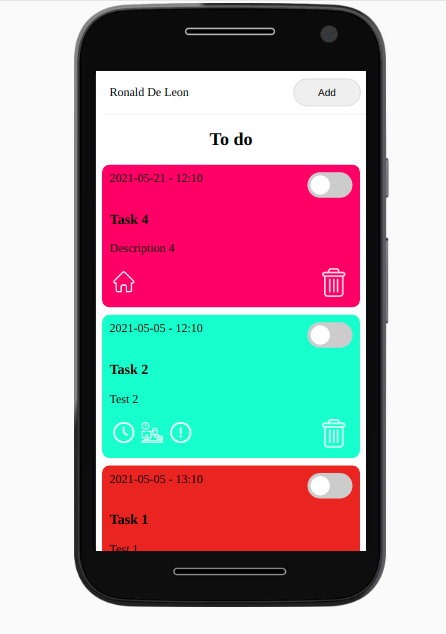
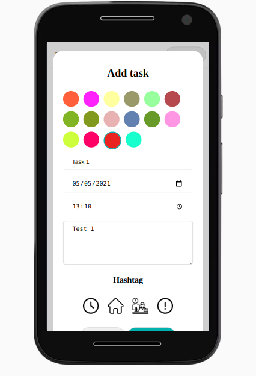

# ToDo PWA

Esta es una app de tareas, desarrollada con tecnologia pwa, lo cual permite que se instale en dispositivos y funcionar sin internet.

## APIS
* LocalStorage
* Caches

### Otros
* Sevices Worker

 Este código es parte de un ejercicio de un curso de javascript.
 #### Capturas
 
 

 ##### Demo 
 [Ver demo](https://pwa-rdl.surge.sh/)